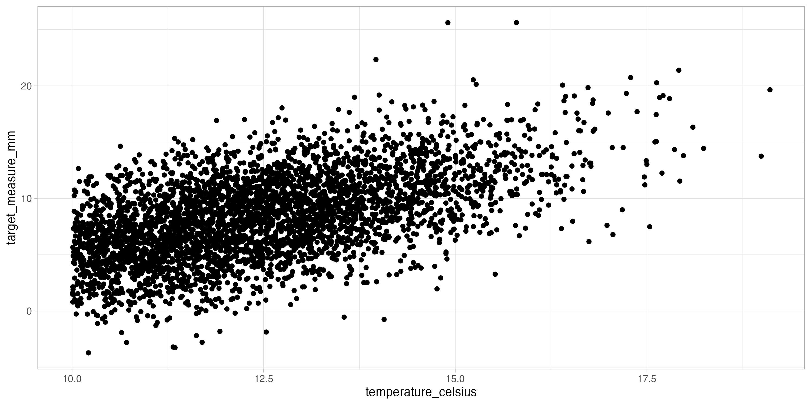

# stat450_lab2

## Temperature vs. Target Measure (mm) Scatter Plot

This scatter plot shows a positive relationship between temperature (°C) on the x-axis and target_measure (mm) on the y-axis. As temperature increases, the target measure increases as well. The points are densely clustered at lower temperatures (around 10–13 °C) with moderate spread. The variability appears to increase slightly at higher temperatures, with a few higher-value outliers.